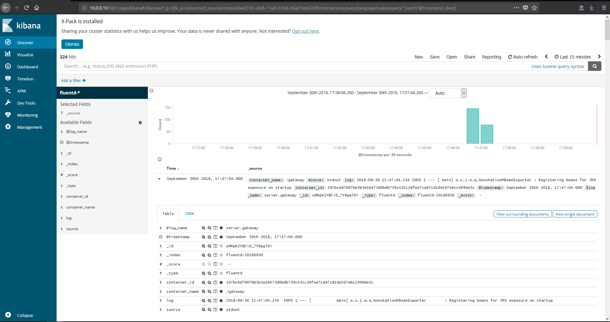
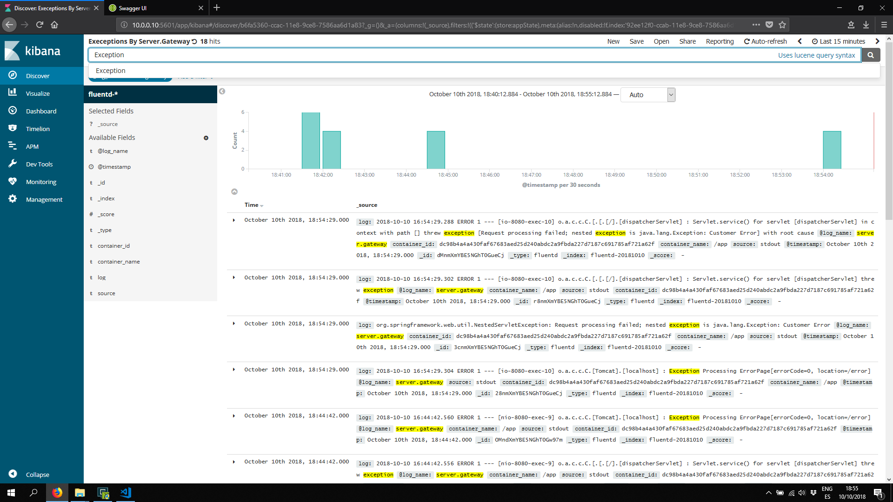
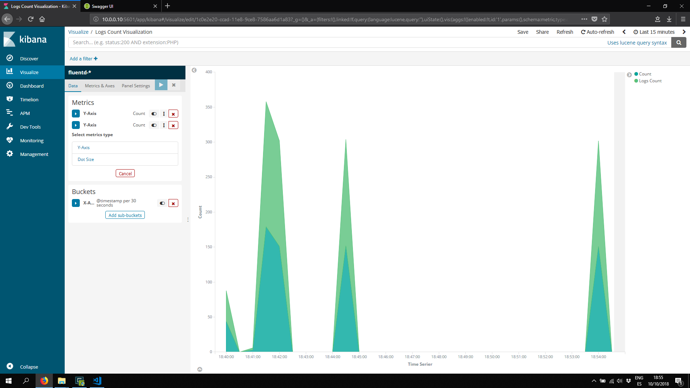
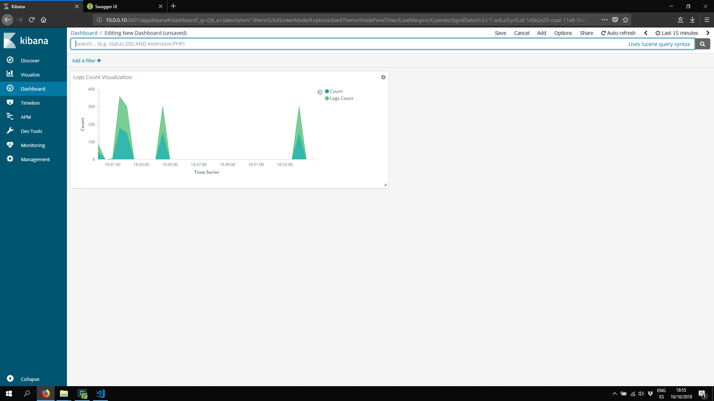

# LOGGING

## Introduction

As applications evolve to become ever more complex, having clear visibility of metric and event data to improve **monitoring**, **troubleshooting** and understanding is becoming even more crucial to ensure the performance of your app. Fortunately, there is an incredibly convenient and powerful vehicle to extract everything you need to know about your application: **Logs**.

The usefulness of logs is frequently **underestimated** as they are often thought to be the tail of a hidden */var/log* file, lost in other endless files and inconvenient to use. But, thankfully there are methods to easily benefit from the hidden technical and business value of logs.

Following are some of the best practices:

- Keep it logs simple
- Use logging levels
- Logs to tack activity.
- Avoid side effects
- Tune your pattern (Standard)
- Log method arguments and return values
- Watch out for external systems
- Log exceptions properly
- Logs easy to read, easy to parse

## [The Twelve Factors](https://12factor.net/)

> Treat logs as event streams

**Logs** provide visibility into the *behavior* of a running app. In server-based environments they are commonly written to a file on disk (a “logfile”); but this is *only* an output format.

Logs are the **stream** of aggregated, time-ordered **events** collected from the output streams of all running processes and backing services. Logs in their raw form are typically a ``text`` format with one event per line (though backtraces from exceptions may span multiple lines). Logs have **no** fixed beginning or end, but flow continuously as long as the app is operating.

```txt
21:32:10.311 [main] DEBUG com.baeldung.logback.LogbackTests - Logging message: This is a String
21:32:10.316 [main] DEBUG com.baeldung.logback.LogbackTests - Going to divide 42 by 0
21:32:10.316 [main] ERROR com.baeldung.logback.LogbackTests - Error dividing 42 by 0
java.lang.ArithmeticException: / by zero
  at com.baeldung.logback.LogbackTests.givenParameters_ValuesLogged(LogbackTests.java:64)
...
```

A **twelve-factor** app never concerns itself with routing or storage of its output stream. It should **not** attempt to write to or manage logfiles. Instead, each running process writes its event stream, unbuffered, to **stdout**.

> During local development, the developer will view this stream in the foreground of their terminal to observe the app’s behavior.

In staging or production deploys, each process’ stream will be captured by the execution environment, collated together with all other streams from the app, and routed to one or more **final** destinations for viewing and long-term archival. These archival destinations are not visible to or configurable by the app, and instead are **completely** managed by the execution environment. Open-source **log routers** (such as ``Logstash`` and ``Fluentd``) are available for this purpose.

```yaml
version: '3'
services:
  app-gateway:
    build: app-gateway
    container_name: app-gateway
    ports:
    - 8080:8080
    logging:
      driver: "fluentd"
      options:
        fluentd-address: 10.0.0.10:24224
        # Instances created will use the same aggregation-key: server.app-gateway
        # This key applies for all: scaled replicas, re-started instances, new versions, etc.. for the same service (app-gateway)
        tag: server.app-gateway
    depends_on:
    - fluentd  
```

The **event** stream for an app can be routed to a file, or watched via realtime tail in a terminal. Most significantly, the stream can be sent to a log indexing and **analysis** system such as Splunk, or a general-purpose data warehousing system such as Hadoop/Hive. These systems allow for great power and flexibility for introspecting an app’s behavior over time, including:

- **Finding** specific events in the past.
- Large-scale **graphing** of trends (such as requests per minute).
- Active **alerting** according to user-defined heuristics (such as an alert when the quantity of errors per minute exceeds a certain threshold).

## ELK/EFK

**ELK** or **EFK** are is the acronyms for four open source projects: **Elasticsearch**, **Logstash**, **fluentd** and **Kibana**.

- **Elasticsearch** is a search and analytics engine.
- **Logstash** is a server‑side data processing pipeline that ingests data from multiple sources simultaneously, transforms it, and then sends it to a "stash" like Elasticsearch.
- **Kibana** lets users visualize data with charts and graphs in Elasticsearch.


Together, these different open-source products are most commonly used for **centralized** logging in IT environments (though there are many more use cases for the ELK Stack including business intelligence, security and compliance, and web analytics). Logstash collects and parses logs, and then Elasticsearch indexes and stores the information. Kibana then presents the data in visualizations that provide actionable insights into one’s environment.



## Logging

Logging aggregation techniques work in a polyglot architecture since it must be independent on the technology, the ``collector/transformation`` server (**fluentd**, **logstash**, **syslog**) must aggregate all the different sources into the proper one and performing the needed transformation before the are transferred to the datasource.

### Docker Logging Driver (fluentd)

For this example we are using **fluentd**, that is a logging driver integrated into Docker to redirect the **stodout** from application logs directly into an application. This means the aplications only must be care of the proper ubiquitous formatting for the messages and redirect the logs into directly into stodout.

Here are some other [logging drivers](https://docs.docker.com/config/containers/logging/configure/) supported by docker: ``none``, ``awslogs`` (cloudwatch), ``fluentd``, ``syslog``, ``gcplogs`` (Gloogle clould Paltform), ``json-file``, etc.

In order to select the driver using *docker* command:

    docker run -it --log-driver none alpine ash

Using docker-compose we need to use the following settings:

```yaml
version: '3'
services:
  app-gateway:
    build: app-gateway
    container_name: app-gateway
    ports:
    - 8080:8080
    logging:
      driver: "fluentd"
      options:
        fluentd-address: 10.0.0.10:24224
        tag: server.app-gateway
    depends_on:
    - fluentd  
```

fluentd logger has serveral options that need to be set in order to redirect the outputs into a fluentd server.

- ``fluentd-address``: fluentd servers address to aggregate/transform the logs
- ``tag``: tag-name given for the current service. This tag will be used for **fluentd** for clustering and make aggregations for distributed logs accordingly.

### Fluentd

Following a basic configuration using **fluentd**, to redirect the logs from docker into **elasticsearch**.

``dockerfile``

```dockerfile
FROM fluent/fluentd:stable
RUN ["gem", "install", "fluent-plugin-elasticsearch", "--no-rdoc", "--no-ri", "--version", "2.4.0"]
```

``fluent.conf``

```xml
# Fluentd main configuration file
# Reference: https://docs.fluentd.org/v1.0/articles/config-file

# Set Fluentd to listen via http on port 8080, listening on all hosts
#<source>
#  @type http
#  port 8080
#  bind 0.0.0.0
#</source>

# Set Fluentd to listen via http on port 24224, listening on all hosts
# https://docs.fluentd.org/v0.12/articles/parser_multiline
<source>
  @type forward
  port 24224
  bind 0.0.0.0
</source>

# Events having prefix 'gateway.' will be stored both on Elasticsearch and files.
<match server.**>
  @type copy
  <store>
    @type elasticsearch
    host elasticsearch
    port 9200
    index_name fluentd
    type_name fluentd
    logstash_format true
    logstash_prefix fluentd
    logstash_dateformat %Y%m%d
    include_tag_key true
    tag_key @log_name
    flush_interval 1s
  </store>
  <store>
    # @type file
    # path /logs/myapp
    # flush_interval 30s
    @type stdout
  </store>
</match>

# All other events will be printed to stdout
<match **>
  @type stdout
</match>
```

This is the docker-compose file. Note previous ``dockerfile`` and ``fluent.conf`` are used in the example.

The port ``24224`` is used for the docker logging driver to redirect the logs into that host:port where flunetd is listening,

```yml
fluentd:
    build: ./fluentd
    volumes:
      - ./fluentd/conf:/fluentd/etc
    ports:
      - 8090:8080
      - 24224:24224
      - 24224:24224/udp
    healthcheck:
        test: ["CMD", "curl", "-f", "http://fluentd:8090"]
        interval: 30s
        timeout: 10s
        retries: 5
```

### EFK

Following there is the complete ``docker-compose`` file to deploy a basic EFK ecosystem.

Note the following statements:

- **Elastisearch**: it provides the data persistence and the search engine capabilities. It has no dependendies on other components.
- **Kibana**: Kibana is the graphical interface used to show information related to distributed logs aggregated onto the system. **kibana** points to **elastissearch**.
- **fluentd**: this is the server where all the logs are going to be aggreated and transformed (``json``). In this case these aggregated/transformed are going to be sent also to **elasticsearch** to enable future troobleshooting and analytics.
- **apps**: applications and services that are going to generate logs. Applications are independent on the internal distributed logging infraestructure. For this reason, docker provides the logging driver so it can be set externally.
 

```yml
version: '3'
services:
  app:
    build: ./gateway/build/jib-docker-context
    container_name: app
    ports:
    - 8080:8080
    logging:
      driver: "fluentd"
      options:
        fluentd-address: 10.0.0.10:24224
        tag: server.gateway
    depends_on: 
    - fluentd  

  elasticsearch:
    image: docker.elastic.co/elasticsearch/elasticsearch:6.2.4
    environment:
      discovery.type: single-node
    ports:
      - 9200:9200
      - 9300:9300

  fluentd:
    build: ./fluentd
    volumes:
      - ./fluentd/conf:/fluentd/etc
      # - ./logs:/logs
    ports:
      - 8090:8080
      - 24224:24224
      - 24224:24224/udp
    healthcheck:
        test: ["CMD", "curl", "-f", "http://fluentd:8090"]
        interval: 30s
        timeout: 10s
        retries: 5

  kibana:
    image: docker.elastic.co/kibana/kibana:6.2.4
    environment:
      ELASTICSEARCH_URL: http://elasticsearch:9200
    ports:
      - 5601:5601
```

## Kibana

**Kibana** is a graphical user interface to visualize data provided by **Elasticsearch** with charts and graphs. **Elasticsearch** is a powerfull datasource that stores all the aggregations collected into the system in real-time. It also provide indexing and high-performances query operatiion over the data.

kibana provides tons of functionalities, here are some of them:

1. **Discover** method.

    This allows to set indexing cabapilities over the existing data in **elasticsearch**, by specifying a ``name pattern`` and *other* indexes such as ``timestamp``. These indexes are used for filters and queries for performances reasons. These indexes are internally used by elasticsearch to create internal data structures to combine with other ordering algorithms such as b-trees, Aho–Corasick, etc.. Kibana uses the elasticsearch interface to provide a powerful set to tools to optimize the queries.

    > Please go to http://localhost:5601/ with your browser. Then, you need to set up the index name pattern for Kibana. Please specify ``fluentd-*`` to ``Index name or pattern`` and press **Create** button. Then, go to **Discover** tab to seek for the logs. As you can see, logs are properly collected into Elasticsearch + Kibana, via Fluentd.

2. Creating custom **Search** in kibana

    Searches are created using **expressions** and **filters**. The performances on this quieries will depend on the indexes created and the structure of the data. Elasticsearch uses a ``json`` format, for this reason is also important to parse the format of the logs (from stdout) to filter addtional information such as: ``traceId``, ``spanId``, ``threadName``, ``timestamp``, ``message``, etc...

    

3. Creating **Visualization** fron Custom Search

    

4. Creating **Dashboards** from Visusalization

    

5. **Alerts**, **Monitoring tools**, etc..
