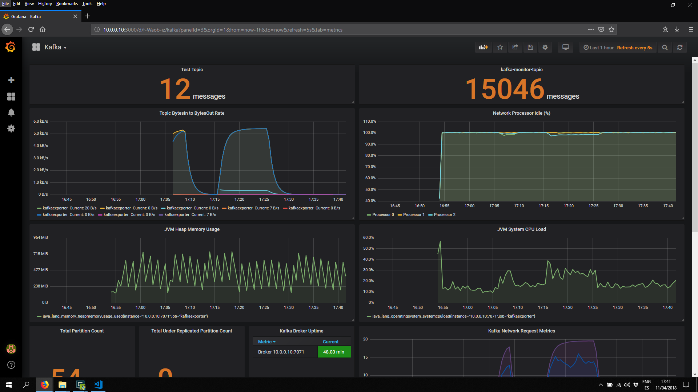
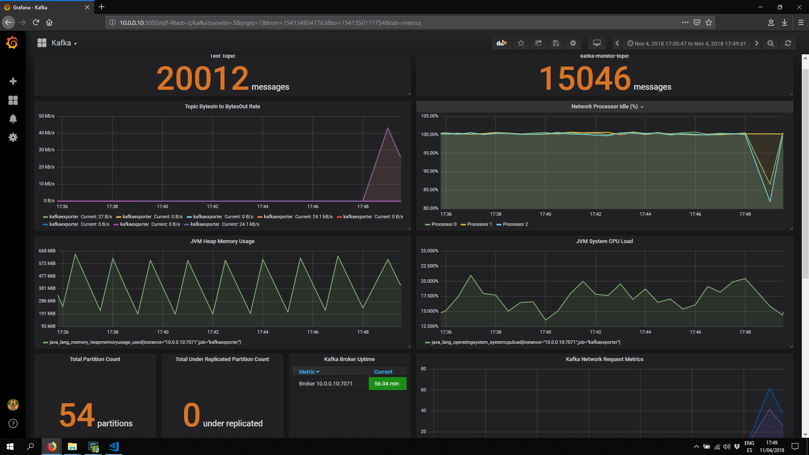
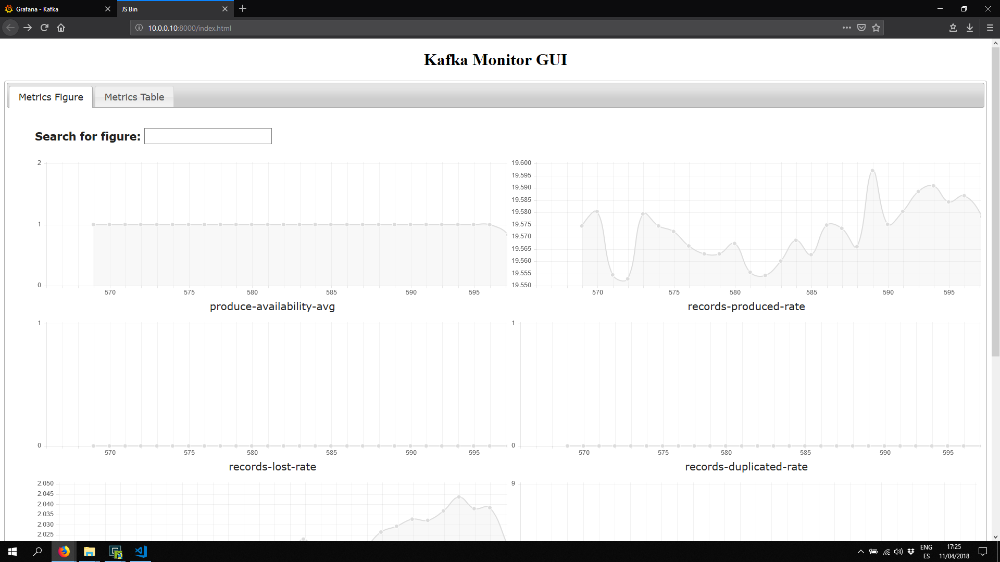
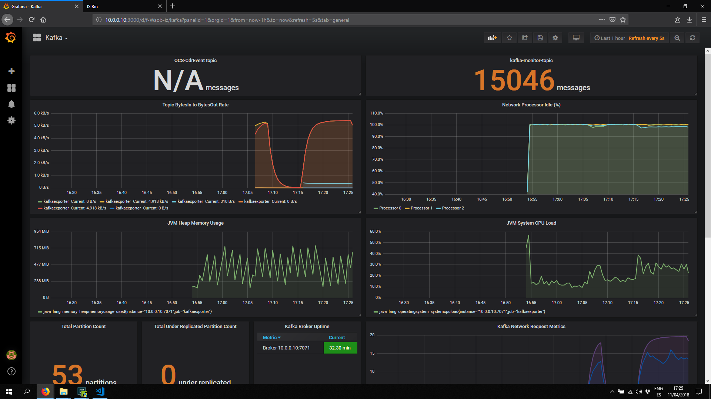
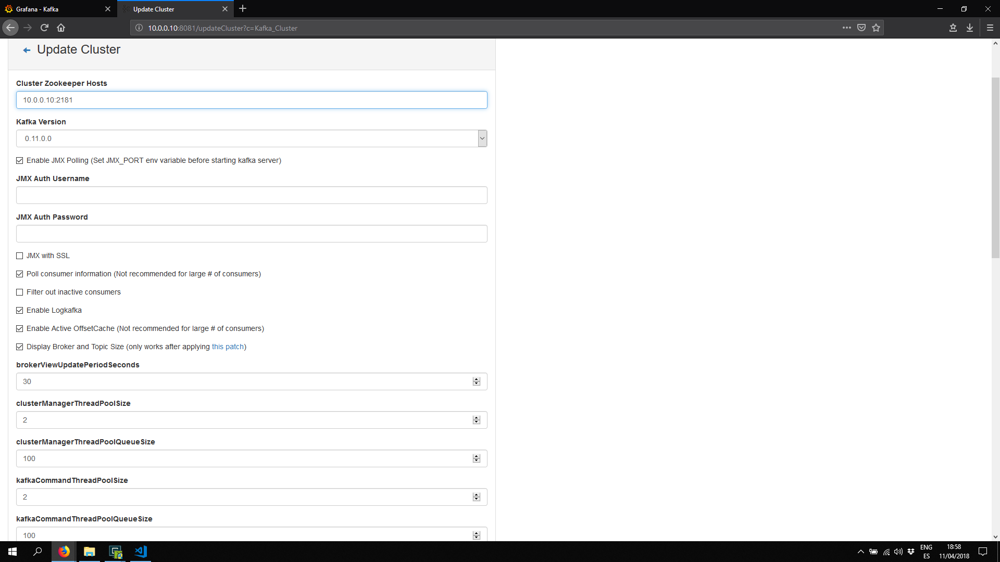
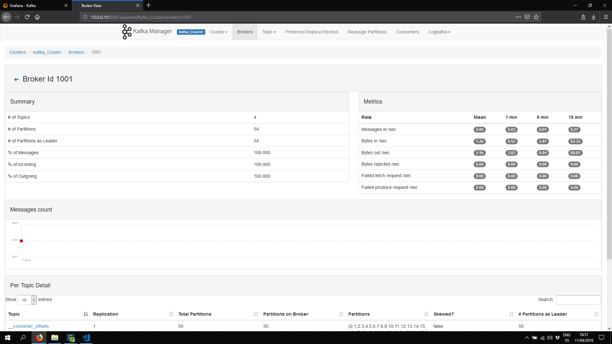
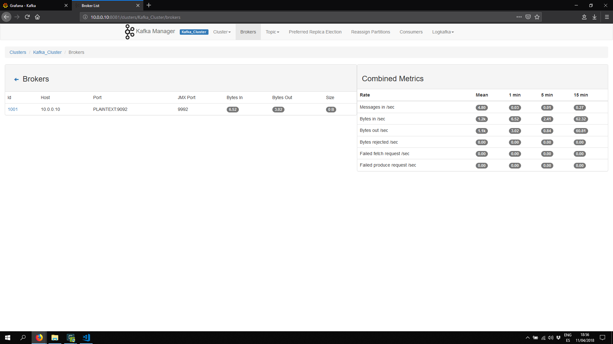
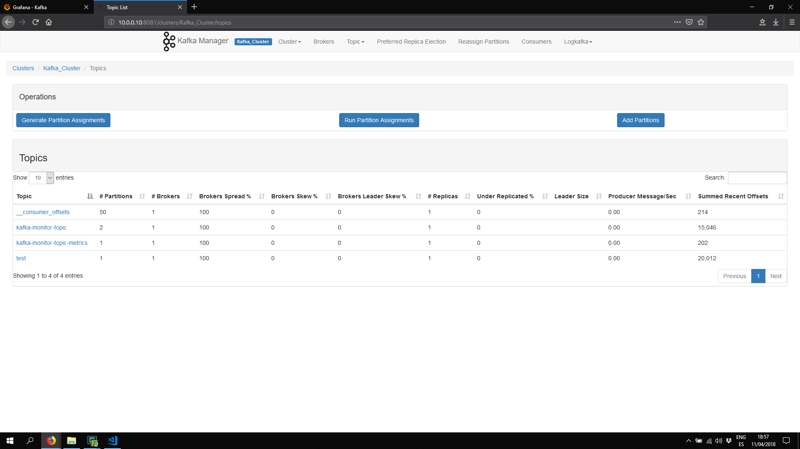
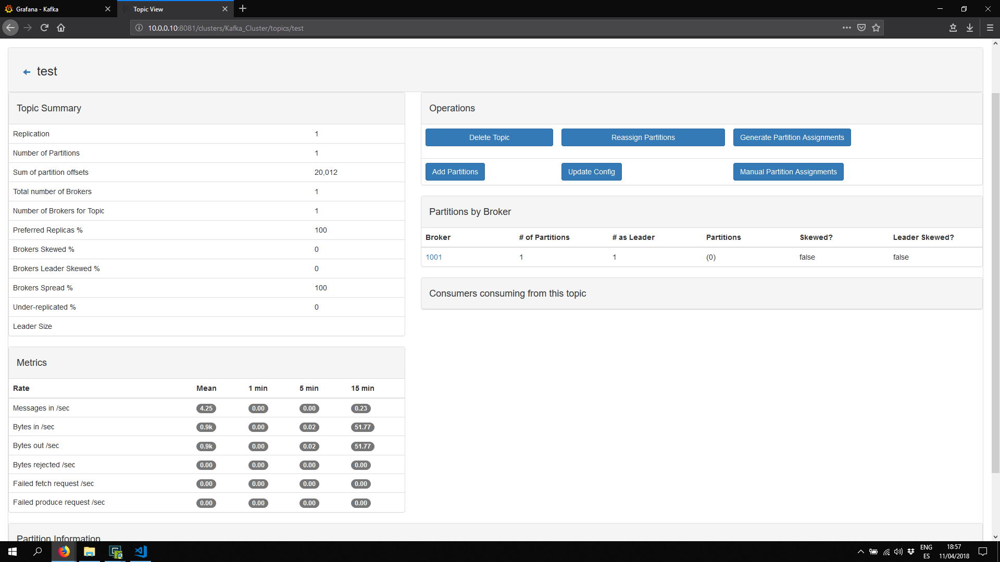

# Installing Additional Monitoring Tools

## Initialization

### Monitoring and Kafka Clusters

- Run the following commands using `Kafka-Monitoring-Cluster`

        # Start the virtual machine and connect to ir via ssh
        vagrant up
        vagrant ssh

        # Start both Monitoring and Kafka cluster with all the needed components
        sudo docker-compose -f /vagrant/deployments/docker-compose.yml up
        sudo docker-compose -f /vagrant/deployments/docker-compose-kafka-jmx-exporter.yml up

### Grafana Dashboard

- Access to Grafana using this [link](http://10.0.0.10:3000) (admin/admin)

- Add `Prometheus` data-source

        Name: Prometheus
        Type: Prometheus
        URL: http://10.0.0.10:9090

- Add Grafana **dashboards**:

  - Node Exporter: *405*
  - CAdvisor: *893*
  - Kafka Exporter: *kafka_dashboard.json*

  > Select **Prometheus** Source in all of them. Select customer **range period** of time and **refresh time**.

## ProducerPerformance

This is a command line tool to test the performances of the kafka cluster.

### Create Topic

- Create a docker container with a kafka instance (check the current kafka version)

        sudo docker run -it wurstmeister/kafka:0.11.0.1 bash

- Create a Topic for the tests

        # Partitions: 1 Replication-factor: 1
        kafka-topics.sh --create --topic test --zookeeper 10.0.0.10:2181 --partitions 1 --replication-factor 1

        # Partitions: 10 Replication-factor: 2
        kafka-topics.sh --create --topic test2 --zookeeper 10.0.0.10:2181 --partitions 10 --replication-factor 2

> Use different ``topic`` configurations such as** replicas factor** or **number of partitions** for performances.

- Verify the topic has been created correctly

        kafka-topics.sh --list --zookeeper 10.0.0.10:2181
        kafka-topics.sh --describe --zookeeper 10.0.0.10:2181

- Check the topic and the kafka produce and consume correctly the topics.

        # Start the Producer
        kafka-console-producer.sh --broker-list 10.0.0.10:9092 --topic test

        # Start the Consumer
        kafka-console-consumer.sh --bootstrap-server 10.0.0.10:9092 --topic test --from-beginning

- Create some messages in the **producer** side so the **consumer** receive them



### Create Performances Tests

1. Single thread, no replication

        kafka-topics.sh --create --topic test --zookeeper 10.0.0.10:2181 --partitions 1 --replication-factor 1

        kafka-run-class.sh org.apache.kafka.tools.ProducerPerformance --throughput=1000 --topic=test --num-records=20000 --record-size=200 --producer-props bootstrap.servers=10.0.0.10:9092 buffer.memory=67108864 batch.size=64000

        4993 records sent, 998.0 records/sec (0.19 MB/sec), 11.3 ms avg latency, 169.0 max latency.
        5058 records sent, 1011.6 records/sec (0.19 MB/sec), 13.9 ms avg latency, 74.0 max latency.
        4993 records sent, 997.2 records/sec (0.19 MB/sec), 23.5 ms avg latency, 156.0 max latency.
        20000 records sent, 999.850022 records/sec (0.19 MB/sec), 13.96 ms avg latency, 169.00 ms max latency, 8 ms 50th, 51 ms 95th, 98 ms 99th, 140 ms 99.9th.

    

1. Single-thread, async 3x replication

        kafka-topics.sh --zookeeper 10.0.0.10:2181 --create --topic test --partitions 6 --replication-factor 3

        kafka-run-class.sh org.apache.kafka.tools.ProducerPerformance test 50000000 100 -1 acks=1 bootstrap.servers=10.0.0.10:9092 buffer.memory=67108864 batch.size=8196

1. Single-thread, sync 3x replication

        kafka-run-class.sh org.apache.kafka.tools.ProducerPerformance test 50000000 100 -1 acks=-1 bootstrap.servers=10.0.0.10:9092 buffer.memory=67108864 batch.size=64000

1. Three Producers, 3x async replication

        kafka-run-class.sh org.apache.kafka.tools.ProducerPerformance test 50000000 100 -1 acks=1 bootstrap.servers=10.0.0.10:9092 buffer.memory=67108864 batch.size=8196

1. Throughput Versus Stored Data

        kafka-run-class.sh org.apache.kafka.tools.ProducerPerformance test 50000000000 100 -1 acks=1 bootstrap.servers=10.0.0.10:9092 buffer.memory=67108864 batch.size=8196

1. Effect of message size

    ```bash
    for i in 10 100 1000 10000 100000;
    do
        echo ""
        echo $i
        kafka-run-class.sh org.apache.kafka.tools.ProducerPerformance test $((1000*1024*1024/$i)) $i -1 acks=1 bootstrap.servers=10.0.0.10:9092 buffer.memory=67108864 batch.size=128000
    done;
    ```

## kafka-monitor

[kafka-monitor](https://github.com/linkedin/kafka-monitor)

**Kafka Monitor** is a **framework** to implement and execute *long-running* kafka system **tests** in a real cluster. It complements Kafka’s existing system tests by capturing potential bugs or regressions that are only likely to occur after prolonged period of time or with low probability. Moreover, it allows you to monitor Kafka cluster using end-to-end pipelines to obtain a number of derived vital stats such as end-to-end latency, service availability and message loss rate. You can easily deploy Kafka Monitor to test and monitor your Kafka cluster without requiring any change to your application.

Kafka Monitor can automatically create the monitor **topic** with the specified config and increase **partition count** of the monitor topic to ensure ``partition# >= broker#``. It can also reassign partition and trigger preferred leader election to ensure that each broker acts as leader of at least one partition of the monitor topic. This allows Kafka Monitor to detect performance issue on every broker without requiring users to manually manage the partition assignment of the monitor topic.

### Pre-requisites

- Install ``Unzip`` and ``Wget``

        sudo apt-get install unzip wget -y

- Install Java ``Openjdk`` 8

        # Installing openjdk version
        sudo add-apt-repository ppa:openjdk-r/ppa
        sudo apt update
        sudo apt-get install openjdk-8-jdk

        # Switch the current jvm environment version
        sudo update-alternatives --config java
        sudo update-alternatives --config javac
        sudo update-alternatives --config javaws

- Install ``Gradle``

        # Download desired version of Gradle
        wget https://services.gradle.org/distributions/gradle-4.10.2-bin.zip

        # Change permissions and ownership of gradle folder
        sudo mkdir /opt/gradle
        sudo chmod -R 755 /opt/gradle
        sudo chown vagrant:vagrant /opt/gradle

        # Unzip files to folder
        unzip -d /opt/gradle gradle-4.10.2-bin.zip

        # Add gradle binaries to global path (.bashrc)
        sudo nano /etc/profile
        export PATH=$PATH:/opt/gradle/gradle-4.10.2/bin

        # Refresh the changes made
        source /etc/profile

        # Verify the installation
        gradle -version

- Download ``Kafka-monitor`` from Git

        git clone https://github.com/linkedin/kafka-monitor.git
        cd kafka-monitor
        ./gradlew jar

### Start Kafka Monitor

- Configure ``Kafka`` and ``Zookeeper`` instances and test **parameters**

        sudo nano config/kafka-monitor.properties

    ```json
    {
        "single-cluster-monitor": {
            "class.name": "com.linkedin.kmf.apps.SingleClusterMonitor",
            "topic": "kafka-monitor-topic",
            "zookeeper.connect": "10.0.0.10:2181",
            "bootstrap.servers": "10.0.0.10:9092",
            "produce.record.delay.ms": 100,
            "topic-management.topicCreationEnabled": true,
            "topic-management.replicationFactor" : 1,
            "topic-management.partitionsToBrokersRatio" : 2.0,
            "topic-management.rebalance.interval.ms" : 600000,
            "topic-management.topicFactory.props": {
            },
            "topic-management.topic.props": {
            "retention.ms": "3600000"
            },
            "produce.producer.props": {
            "client.id": "kmf-client-id"
            },
            "consume.latency.sla.ms": "20000",
            "consume.consumer.props": {
            }
        },

        "jetty-service": {
            "class.name": "com.linkedin.kmf.services.JettyService",
            "jetty.port": 8000
        },

        "jolokia-service": {
            "class.name": "com.linkedin.kmf.services.JolokiaService"
        },

        "reporter-service": {
            "class.name": "com.linkedin.kmf.services.DefaultMetricsReporterService",
            "report.interval.sec": 1,
            "report.metrics.list": [
            "kmf:type=kafka-monitor:offline-runnable-count",
            "kmf.services:type=produce-service,name=*:produce-availability-avg",
            "kmf.services:type=consume-service,name=*:consume-availability-avg",
            "kmf.services:type=produce-service,name=*:records-produced-total",
            "kmf.services:type=consume-service,name=*:records-consumed-total",
            "kmf.services:type=consume-service,name=*:records-lost-total",
            "kmf.services:type=consume-service,name=*:records-duplicated-total",
            "kmf.services:type=consume-service,name=*:records-delay-ms-avg",
            "kmf.services:type=produce-service,name=*:records-produced-rate",
            "kmf.services:type=produce-service,name=*:produce-error-rate",
            "kmf.services:type=consume-service,name=*:consume-error-rate"
            ]
        }
    }
    ```

- Start ``kafka-monitor``

        ./bin/kafka-monitor-start.sh config/kafka-monitor.properties

- Check **Kafka-monitor** dashboard [link](http://10.0.0.10:8000/index.html).

    

- Check **Grafana** dashboard [link](http://10.0.0.10:3000). Add topic being tested ``kafka-monitor-topic``.

    

## Kafka-Manager

[Kafka-Manager](https://github.com/yahoo/kafka-manager)

## Pre-Requisites

        # Install Java jdk
        sudo apt-get update
        sudo apt-get install default-jdk

        ## Install Scala
        sudo apt-get remove scala-library scala
        sudo wget http://scala-lang.org/files/archive/scala-2.12.7.deb
        sudo dpkg -i scala-2.12.7.deb
        sudo apt-get update
        sudo apt-get install scala

        ## Install sbt
        echo "deb https://dl.bintray.com/sbt/debian /" | sudo tee -a /etc/apt/sources.list.d/sbt.list
        sudo apt-key adv --keyserver hkp://keyserver.ubuntu.com:80 --recv 2EE0EA64E40A89B84B2DF73499E82A75642AC823
        sudo apt-get update
        sudo apt-get install sbt

        # Check both scala and sbt versions installed
        scala -version
        sbt -version

### Installation

- Get the source-code from Git

        git clone https://github.com/yahoo/kafka-manager.git

- Configure ``kafka`` and ``Zookeeper`` instances

        cd kafka-manager
        sudo nano conf/application.conf

> Change the ``kafka-manager.zkhosts="my.zookeeper.host.com:2181"`` entry by ``10.0.0.10:2181``

- Compile and create a compressed zip file with the distribution for ``kafka-manager``

        ./sbt clean dist

> This will take some time. If some errors when downloading dependencies try again.

- Unzip the content of the package

        unzip -d . /home/vagrant/kafka-manager/target/universal/kafka-manager-1.3.3.21.zip

- Start ``kafka-manager``

        ./kafka-manager-1.3.3.21/bin/kafka-manager -Dconfig.file=conf/application.conf -Dhttp.port=8081

> By default the port configured is 9000

- Go to ``kafka-manager`` dashboard using this [link](http://10.0.0.10:8081) and configure a cluster

    

- Following information about broker, topics, etc..

    
    
    
    