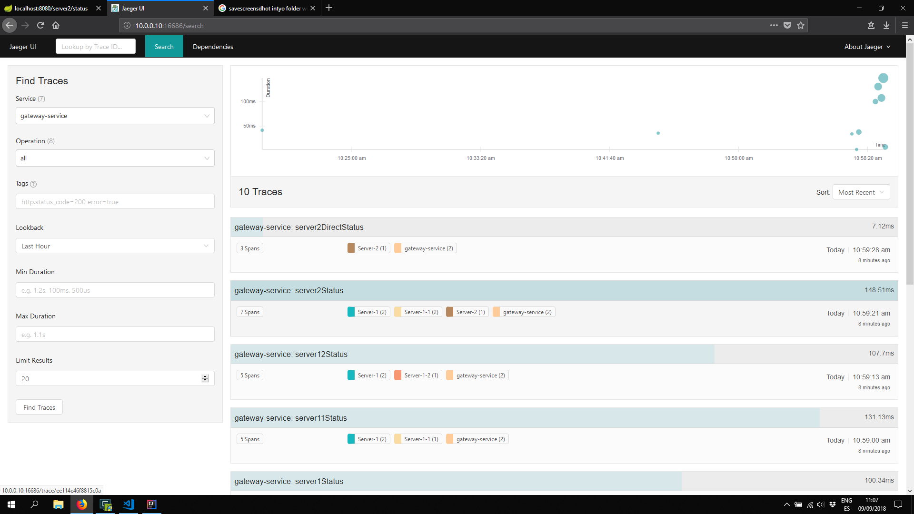
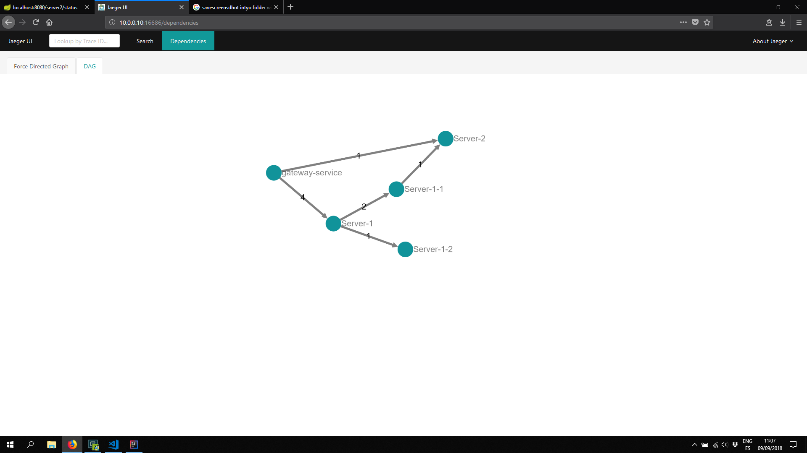
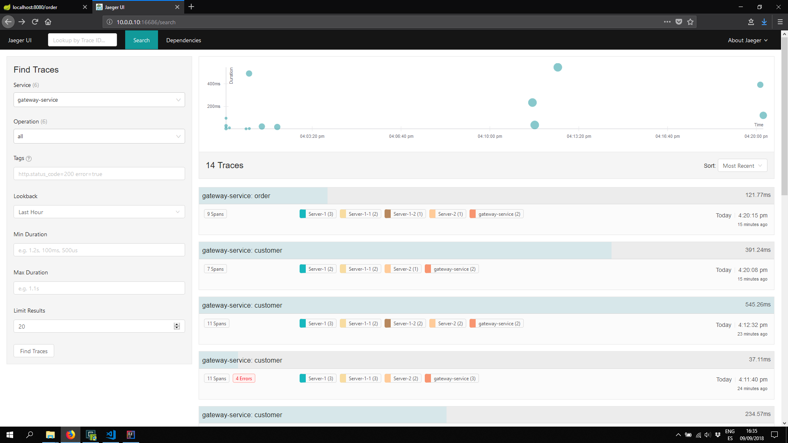
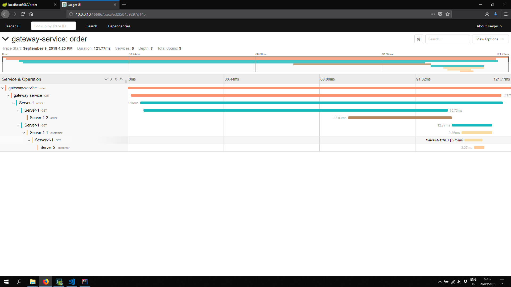
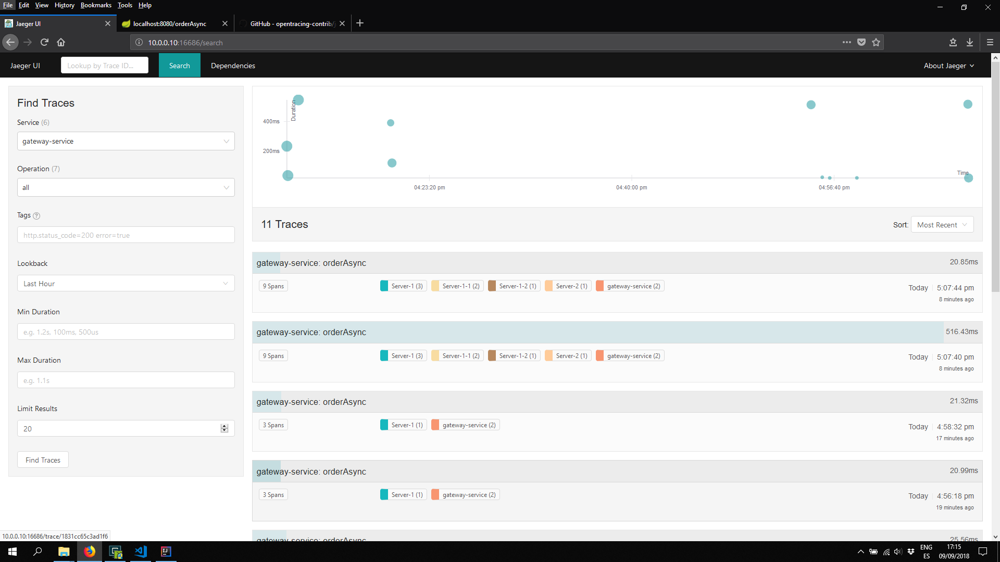
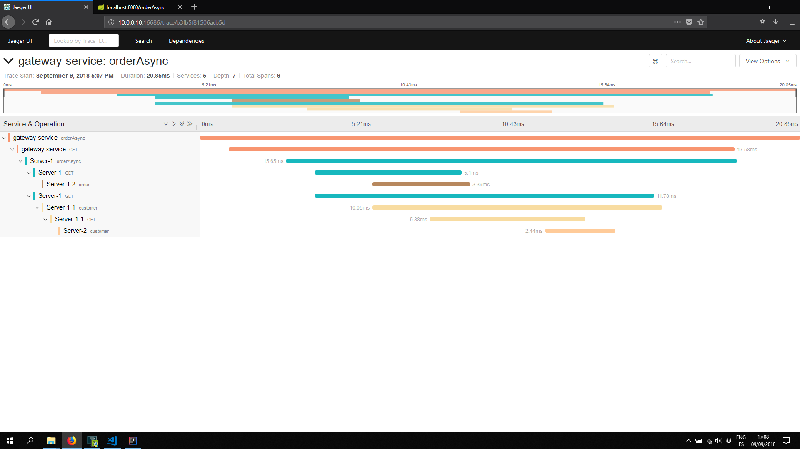
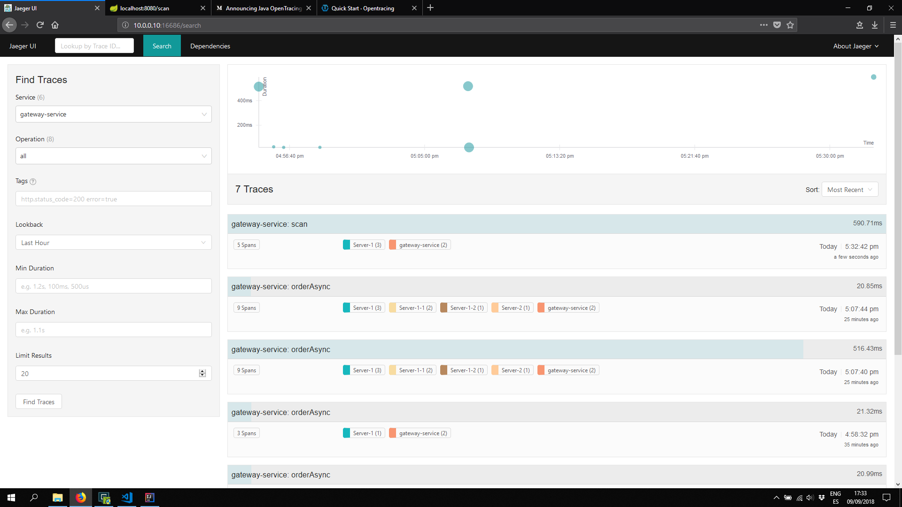
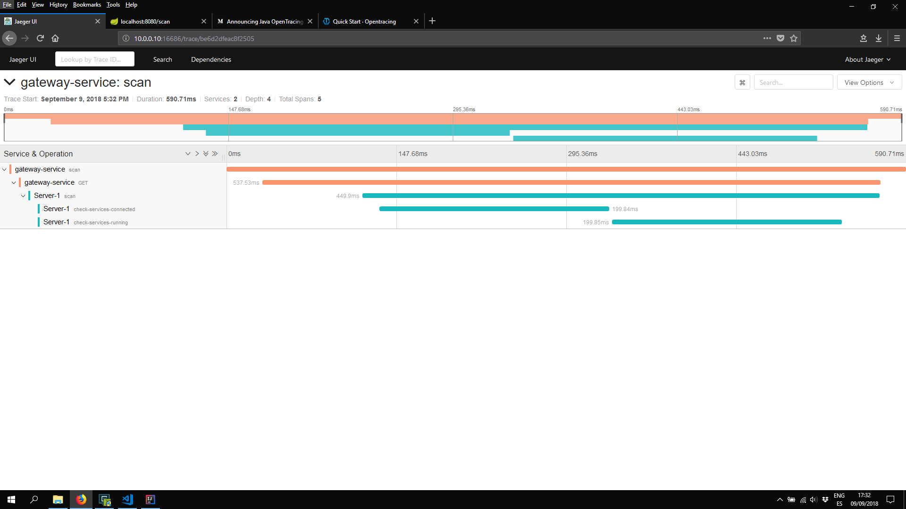
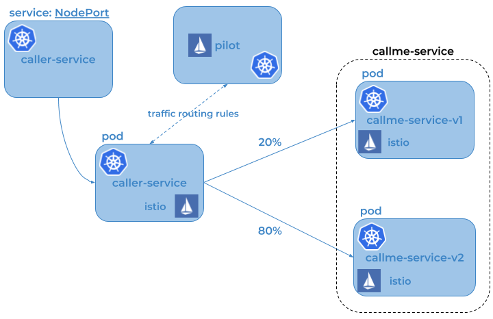

# TRACING

## Introduction

### Tracing

Developers and engineering organizations are trading in old, monolithic systems for modern microservice architectures, and they do so for numerous compelling reasons: system components scale independently, dev teams stay small and agile, deployments are continuous and decoupled, and so on.

That said, once a production system contends with real concurrency or splits into many services, crucial (and formerly easy) tasks become difficult:

- *user-facing latency optimization*
- *root-cause analysis of backend errors*
- *communication about distinct pieces of a now-distributed system*
- *others*

Contemporary **distributed tracing systems** (e.g., **Zipkin**, **Jaeger**, Dapper, HTrace, X-Trace, among others) aim to address these issues, but they do so via *application-level* instrumentation using **incompatible** APIs. 

Developers are **uneasy** about tightly coupling their polyglot systems to any particular distributed tracing implementation, yet the application-level instrumentation APIs for these many distinct tracing systems have remarkably **similar** semantics.

### Why **OpenTracing**

Enter **OpenTracing** by offering **consistent**, **expressive**, **vendor-neutral APIs** for popular platforms, OpenTracing makes it easy for developers to add (or switch) tracing implementations with an O(1) configuration change.

OpenTracing also offers a lingua franca for OSS **instrumentation** and **platform-specific tracing helper** libraries.

### What is a **Trace**

At the highest level, a **trace** tells the **story** of a **transaction** or workflow as it propagates through a (potentially distributed) system. In OpenTracing, a trace is a **directed acyclic graph** (DAG) of **spans**: named, timed operations representing a contiguous segment of work in that trace.

**SpanContext** refers to a *call* that has been exchanged between two services (service1 -> service2, DAG). This RPC call uses the same traceId, however the span must be unique with a timestamp and other metadata that can be appended into the span such as: parentId, tag, Event-type, etc..

**Tracer** interface that must be implemented by the different **providers** or user cases: java spring boot, rxJava, rabbitmq-client, kafka-client, etc..

```java

package io.opentracing;

import io.opentracing.propagation.Format;

/**
 * Tracer is a simple, thin interface for Span creation and propagation across arbitrary transports.
 */
public interface Tracer {
  
    ScopeManager scopeManager();

    Span activeSpan();

    SpanBuilder buildSpan(String operationName);

    <C> void inject(SpanContext spanContext, Format<C> format, C carrier);

    <C> SpanContext extract(Format<C> format, C carrier);

    interface SpanBuilder {

        SpanBuilder asChildOf(SpanContext parent);

        SpanBuilder asChildOf(Span parent);

        SpanBuilder addReference(String referenceType, SpanContext referencedContext);

        SpanBuilder ignoreActiveSpan();

        /** Same as {@link Span#setTag(String, String)}, but for the span being built. */
        SpanBuilder withTag(String key, String value);

        /** Same as {@link Span#setTag(String, boolean)}, but for the span being built. */
        SpanBuilder withTag(String key, boolean value);

        /** Same as {@link Span#setTag(String, Number)}, but for the span being built. */
        SpanBuilder withTag(String key, Number value);

        /** Specify a timestamp of when the Span was started, represented in microseconds since epoch. */
        SpanBuilder withStartTimestamp(long microseconds);

        Scope startActive(boolean finishSpanOnClose);

        Span start();
    }
}

```

### Basic approach: **Inject**, **Extract**, and **Carriers**

Any **SpanContext** in a **trace** may be **Injected** into what OpenTracing refers to as a **Carrier**. A **Carrier** is an interface or data structure that's useful for inter-process communication (IPC); that is, the **Carrier** is something that ``carries`` the tracing state from one process to another.

The OpenTracing specification includes two required Carrier formats, though custom Carrier formats are possible as well.

Similarly, given a Carrier, an injected trace may be **Extracted**, yielding a SpanContext instance which is semantically identical to the one Injected into the Carrier.

### Exampe Sequence

> Following sequence shows how it is implemented ``Tracer`` interface from *OpenTracing API* using **HTTP** protocol. The way traceId, spans, etc.. are injected/extracted is by using the *headers* defined in HTTP protocol. For other protocols this could not be possible, for example using *kafka* those parameters might be injected/extracted using the meta-data.

1. A client process has a ``SpanContext`` instance and is about to make an **RPC** over a home-grown HTTP protocol
2. That client process calls ``Tracer.Inject(...)``, passing the active ``SpanContext`` instance, a format identifier for a text map, and a text map **Carrier** as parameters
3. **Inject** has populated the text map in the **Carrier**; the client application **encodes** that map within its homegrown HTTP protocol (e.g., as *headers*)
4. The HTTP request happens and the data crosses *process* boundaries...
5. Now in the server process, the application code **decodes** the text map from the homegrown HTTP protocol and uses it to initialize a text map **Carrier**
6. The server process calls ``Tracer.Extract(...)``, passing in the desired operation name, a format identifier for a text map, and the Carrier from above
7. In the absence of data corruption or other errors, the server now has a ``SpanContext`` instance that belongs to the **same** trace as the one in the client

## Implementation (fat-client)

> For this example is going to be used Jaeger, however since we are working on OpenTracing it can be used any implementation that followos the standard OpenTracing API.

1. Start Jaeger using docker

        # Using Jaeger
        sudo docker run -d -p 5775:5775/udp -p 6831:6831/udp -p 6832:6832/udp -p 5778:5778 -p 16686:16686 -p 14268:14268 -p 9411:9411 jaegertracing/all-in-one:latest

        # Using Zipkin instead and use gradle dependencies. (Since Port is already used for jaeger, 9412 is exposed instead)
        sudo docker run -d -p 9412:9411 openzipkin/zipkin

    > Use the [Jaegger client documentation](https://github.com/jaegertracing/jaeger-client-java/tree/master/jaeger-core) and [Available protocols](https://www.jaegertracing.io/docs/1.6/getting-started/) to configure the jaeger's address and port.

1. Gradle dependencies (opentracing and jaeger)

    ```Groovy
    // https://mvnrepository.com/artifact/io.opentracing/opentracing-api
    compile('io.opentracing:opentracing-api:0.31.0')
    // https://github.com/opentracing-contrib/java-concurrent
    compile('io.opentracing.contrib:opentracing-concurrent:0.1.0')

    // Jaeger Implementation
    // https://github.com/opentracing-contrib/java-spring-jaeger
    compile('io.opentracing.contrib:opentracing-spring-jaeger-web-starter:0.2.1')

    // Zipkin Implementation
    // https://github.com/openzipkin-contrib/brave-opentracing
    compile('io.zipkin.brave:brave:5.3.0')
    compile('io.zipkin.reporter2:zipkin-sender-okhttp3:2.7.8')
    compile('io.opentracing.brave:brave-opentracing:0.32.1')

    ```

1. Basically use the following snippet to use OpenTracing API and Jaeger implementation

    > If no settings are changed, spans will be reported to the UDP port *6831* of *localhost*. The simplest way to change this behavior is to set the following properties:

    ```java
    import brave.Tracing;
    import brave.opentracing.BraveTracer;
    import io.jaegertracing.Configuration.ReporterConfiguration;
    import io.jaegertracing.Configuration.SamplerConfiguration;
    import io.jaegertracing.Configuration.SenderConfiguration;
    import io.jaegertracing.internal.samplers.ConstSampler;
    import io.opentracing.Tracer;
    import org.springframework.boot.web.client.RestTemplateBuilder;
    import org.springframework.context.annotation.Bean;
    import org.springframework.context.annotation.Configuration;
    import org.springframework.web.client.RestTemplate;
    import zipkin2.reporter.AsyncReporter;
    import zipkin2.reporter.okhttp3.OkHttpSender;
    import brave.sampler.Sampler;

    @Bean
    public Tracer jaegerTracer() {
        return new io.jaegertracing.Configuration("gateway-service" )
                .withSampler(new SamplerConfiguration().withType(ConstSampler.TYPE).withParam(1))
                .withReporter(new ReporterConfiguration().withLogSpans(true)
                        .withSender(new SenderConfiguration().withAgentHost("10.0.0.10").withAgentPort(6831)))
                .getTracer();
    }

    //@Bean
    public Tracer zipkinTracer() {
        OkHttpSender sender = OkHttpSender.create("http://10.0.0.10:9412/api/v2/spans");
        AsyncReporter reporter = AsyncReporter.create(sender);

        Tracing braveTracer = Tracing.newBuilder()
                .localServiceName("gateway-service")
                .spanReporter(reporter)
                .traceId128Bit(true)
                .sampler(Sampler.ALWAYS_SAMPLE)
                .build();

        return BraveTracer.create(braveTracer);
    }
    ```

> User ``expose OPEN_TRACING_PROVIDER=ZIPKIN`` to set the provider to use **ZIPKIN** or **JAEGER**

1. Verify java logs and jaeger with the **traceId** and **Spans**

    ```txt
    2018-09-08 19:17:14.510  INFO 7112 --- [nio-8080-exec-2] i.j.internal.reporters.LoggingReporter   : Span reported: e18a3bb477929bac:e9fe19d397077ed2:b067b08b660904f7:1 - hello
    2018-09-08 19:17:14.510  INFO 7112 --- [nio-8080-exec-1] i.j.internal.reporters.LoggingReporter   : Span reported: e18a3bb477929bac:b067b08b660904f7:e18a3bb477929bac:1 - GET
    ```

### Demo

#### Servers

- Jaeger Dashboard: http:/10.0.0.10:16686

- Gateway: localhost:8080
  - Swagger UI: localhost:8080/swagger-ui.html
- Server1: localhost:8081
- Server1-1: localhost:8082
- Server1-2: localhost:8083
- Server2: localhost:8084

> A file called ``gradle.properties`` has been included  with thre content ``org.gradle.parallel=true`` to use **build** and **buildrun** in parallel.

#### Configuration

It has been created a **configuration** file to provide some tracing and name convention to discover different services.

``application.properties``

```java
server.port=8084
service.name=Server-2
```

#### Simple Request

- GET localhost:8080/status

- GET localhost:8080/status/chain

#### Tracing Workflow calls

> All calls mihgh by traced starting by the **gateway** server

- GET localhost:8080/status
- GET localhost:8080/status/chain
- GET localhost:8080/server1/status
- GET localhost:8080/server1/server1-1/status
- GET localhost:8080/server1/server1-2/status
- GET localhost:8080/server1/server1-1/server2/status
- GET localhost:8080/server2/status

- GET localhost:8080/customer
- GET localhost:8080/order
- GET localhost:8080/scan

Here are the result it can be obtained using Jaeger dashboard using OpenTracing from [/server1/server1-1/server2/status](http://localhost:8080/server1/server1-1/server2/status)

- Http Respose

    ```txt
    Server Status: Server Status: Server Status: Server-2 is UP
    ```

- Logging Support traces

    ```txt
    > Task :gateway:bootRun
    2018-09-09 11:19:03.251  INFO 15392 --- [io-8080-exec-10] i.j.internal.reporters.LoggingReporter   : Span reported: 12845b510189ad7d:ba6575aff6022624:12845b510189ad7d:1 - GET
    2018-09-09 11:19:03.255  INFO 15392 --- [io-8080-exec-10] c.t.g.controller.GatewayController       : End Call to Server1 endpoint
    2018-09-09 11:19:03.272  INFO 15392 --- [io-8080-exec-10] i.j.internal.reporters.LoggingReporter   : Span reported: 12845b510189ad7d:12845b510189ad7d:0:1 - server2Status

    > Task :server1-1:bootRun
    2018-09-09 11:19:03.209  INFO 9652 --- [nio-8082-exec-8] i.j.internal.reporters.LoggingReporter   : Span reported: 12845b510189ad7d:b9b03b354d7afcd6:150cdfe8ca731b5b:1 - GET
    2018-09-09 11:19:03.213  INFO 9652 --- [nio-8082-exec-8] c.t.server.controller.ServerController   : End Call to Server1 endpoint
    2018-09-09 11:19:03.227  INFO 9652 --- [nio-8082-exec-8] i.j.internal.reporters.LoggingReporter   : Span reported: 12845b510189ad7d:150cdfe8ca731b5b:ea5aaf8d8d561826:1 - server2Status

    > Task :server1:bootRun
    2018-09-09 11:19:03.228  INFO 2400 --- [nio-8081-exec-8] i.j.internal.reporters.LoggingReporter   : Span reported: 12845b510189ad7d:ea5aaf8d8d561826:df7c637d3cf1111a:1 - GET
    2018-09-09 11:19:03.233  INFO 2400 --- [nio-8081-exec-8] c.t.server.controller.ServerController   : End Call to Server1 endpoint
    2018-09-09 11:19:03.249  INFO 2400 --- [nio-8081-exec-8] i.j.internal.reporters.LoggingReporter   : Span reported: 12845b510189ad7d:df7c637d3cf1111a:ba6575aff6022624:1 - server2Status
    ```

- Jaeger Tracing OpenTracing implementation

    
    
    

- There is no **traceId** not **Span** reported outside the server side context

    

#### Sync/Async Workflow calls

- Http Respose (GET localhost:8080/order)

    ```txt
    order: Order-0302 - customer: customer-02313
    ```

- Jaeger Tracing OpenTracing implementation

    
    

> Note ``customer`` (**server1 -> server1-1 -> server2**) and ``order`` (**server1 -> server1-2**) are called in the same **sync** operation. This can be optimized by calling them on parallel using **Asynchronous** models like **reactive** paradigms with **non-blosking** operations.

##### Adding **multi-tasking** support to OpenTracing

- Http Respose (GET localhost:8080/orderAsync)

    ```txt
    order: Order-0302 - customer: customer-02313
    ```

- Following package is neccesary to bind SpanContext and Tracer to threads on multi-threading context.

    ```Groovy
    // https://github.com/opentracing-contrib/java-concurrent
    compile('io.opentracing.contrib:opentracing-concurrent:0.1.0')
    ```

- Create a ``ExecutorService`` using the facade class ``TracedExecutorService`` provided by ``opentracing-concurrent``

    ```java
    import io.opentracing.contrib.concurrent.TracedExecutorService;

    ExecutorService pool =  new TracedExecutorService(Executors.newFixedThreadPool(poolSize), GlobalTracer.get());
    ```

- Create the tasks using the current Pool. In this case the Tracer will be used for all the different threads and contexts.

    ```java
    @RequestMapping("/orderAsync")
    public String orderAsync() throws ExecutionException, InterruptedException {

        Future<ResponseEntity<String>> responseOrderAsync = pool.submit(() -> {
            logger.info("Start Call to Server1-2 endpoint");
            ResponseEntity<String> responseOrder = restTemplate.getForEntity("http://localhost:8083/order", String.class);
            logger.info("End Call to Server1-2 endpoint");
            return responseOrder;
                });
        Future<ResponseEntity<String>> responseCustomerAsync = pool.submit(() -> {
            logger.info("Start Call to Server1-1 endpoint");
            ResponseEntity<String> responseCustomer = restTemplate.getForEntity("http://localhost:8082/customer", String.class);
            logger.info("End Call to Server1-1 endpoint");
            return responseCustomer;
        });

        return String.format("order: %s - customer: %s",responseOrderAsync.get().getBody(),responseCustomerAsync.get().getBody());
    }
    ```

- Verify and compare with previous approach both tasks have been launched in parallel.

    
    

#### Happy/Failure Scenario

- **Happy Path**

  - Server2 Controller

    ```java
    @RequestMapping("/customer")
    public String customer()  {
        return "Customer Info: OK";
        //throw new Exception("Customer Error");
    }
    ```

  - Http Respose (GET localhost:8080/customer)

    ```txt
    Customer Info: OK
    ```

  - Logging Support traces

    ```txt
    > Task :server1-1:bootRun
    2018-09-09 11:22:58.416  INFO 9652 --- [nio-8082-exec-4] c.t.server.controller.ServerController   : Start Call to Server2 endpoint
    2018-09-09 11:22:58.421  INFO 9652 --- [nio-8082-exec-4] i.j.internal.reporters.LoggingReporter   : Span reported: c38cffd5bd7037ba:c9ad57bd4a908c6d:84d23d79b663ebb6:1 - GET
    2018-09-09 11:22:58.422  INFO 9652 --- [nio-8082-exec-4] c.t.server.controller.ServerController   : End Call to Server2 endpoint
    2018-09-09 11:22:58.424  INFO 9652 --- [nio-8082-exec-4] i.j.internal.reporters.LoggingReporter   : Span reported: c38cffd5bd7037ba:84d23d79b663ebb6:9b91ca8028455881:1 - customer

    > Task :server2:bootRun
    2018-09-09 11:22:58.421  INFO 10724 --- [nio-8084-exec-5] i.j.internal.reporters.LoggingReporter   : Span reported: c38cffd5bd7037ba:55f83d6cf8f4a5c5:c9ad57bd4a908c6d:1 - customer

    > Task :gateway:bootRun
    2018-09-09 11:22:58.407  INFO 15392 --- [nio-8080-exec-6] c.t.g.controller.GatewayController       : Start Call to Server1 endpoint
    2018-09-09 11:22:58.427  INFO 15392 --- [nio-8080-exec-6] i.j.internal.reporters.LoggingReporter   : Span reported: c38cffd5bd7037ba:c87484e7b3863f95:c38cffd5bd7037ba:1 - GET
    2018-09-09 11:22:58.428  INFO 15392 --- [nio-8080-exec-6] c.t.g.controller.GatewayController       : End Call to Server1 endpoint
    2018-09-09 11:22:58.430  INFO 15392 --- [nio-8080-exec-6] i.j.internal.reporters.LoggingReporter   : Span reported: c38cffd5bd7037ba:c38cffd5bd7037ba:0:1 - customer
    ```

  - Jaeger Tracing OpenTracing implementation

    

- **Failure Path**

  - Server2 Controller

    ```java
    @RequestMapping("/customer")
    public String customer() throws Exception  {
        //return "Customer Info: OK";
        throw new Exception("Customer Error");
    }
    ```

  - Http Respose (GET localhost:8080/customer)

    ```txt
    Whitelabel Error Page

    This application has no explicit mapping for /error, so you are seeing this as a fallback.
    Sun Sep 09 11:28:40 CEST 2018
    There was an unexpected error (type=Internal Server Error, status=500).
    500 null
    ```

  - Logging Support traces

    ```txt
    java.lang.Exception: Customer Error
        at com.tracing.server.controller.ServerController.customer(ServerController.java:31) ~[main/:na]
        at java.base/jdk.internal.reflect.NativeMethodAccessorImpl.invoke0(Native Method) ~[na:na]
        at java.base/jdk.internal.reflect.NativeMethodAccessorImpl.invoke(NativeMethodAccessorImpl.java:62) ~[na:na]
        at java.base/jdk.internal.reflect.DelegatingMethodAccessorImpl.invoke(DelegatingMethodAccessorImpl.java:43) ~[na:na]
        at java.base/java.lang.reflect.Method.invoke(Method.java:564) ~[na:na]
        at org.springframework.web.method.support.InvocableHandlerMethod.doInvoke(InvocableHandlerMethod.java:209) ~[spring-web-5.0.8.RELEASE.jar:5.0.8.RELEASE]
        ...
        at org.apache.tomcat.util.net.SocketProcessorBase.run(SocketProcessorBase.java:49) [tomcat-embed-core-8.5.32.jar:8.5.32]
        at java.base/java.util.concurrent.ThreadPoolExecutor.runWorker(ThreadPoolExecutor.java:1135) [na:na]
        at java.base/java.util.concurrent.ThreadPoolExecutor$Worker.run(ThreadPoolExecutor.java:635) [na:na]
        at org.apache.tomcat.util.threads.TaskThread$WrappingRunnable.run(TaskThread.java:61) [tomcat-embed-core-8.5.32.jar:8.5.32]
        at java.base/java.lang.Thread.run(Thread.java:844) [na:na]

    2018-09-09 11:28:40.133  INFO 8576 --- [nio-8084-exec-9] i.j.internal.reporters.LoggingReporter   : Span reported: f94969740b2e794d:b21634af0016b30:9ccbca0fedb875a2:1 - error

    > Task :server1:bootRun
    2018-09-09 11:28:39.835  INFO 9212 --- [io-8081-exec-10] o.a.c.c.C.[Tomcat].[localhost].[/]       : Initializing Spring FrameworkServlet 'dispatcherServlet'
    2018-09-09 11:28:39.835  INFO 9212 --- [io-8081-exec-10] o.s.web.servlet.DispatcherServlet        : FrameworkServlet 'dispatcherServlet': initialization started
    2018-09-09 11:28:39.849  INFO 9212 --- [io-8081-exec-10] o.s.web.servlet.DispatcherServlet        : FrameworkServlet 'dispatcherServlet': initialization completed in 14 ms
    2018-09-09 11:28:39.871  INFO 9212 --- [io-8081-exec-10] c.t.server.controller.ServerController   : Start Call to Server1-1 endpoint
    2018-09-09 11:28:40.196  INFO 9212 --- [io-8081-exec-10] i.j.internal.reporters.LoggingReporter   : Span reported: f94969740b2e794d:5698e3608f8c17bf:7aaf28b2f931ba6a:1 - GET
    2018-09-09 11:28:40.205  INFO 9212 --- [io-8081-exec-10] i.j.internal.reporters.LoggingReporter   : Span reported: f94969740b2e794d:7aaf28b2f931ba6a:fcecd09b36aece5:1 - customer
    2018-09-09 11:28:40.209 ERROR 9212 --- [io-8081-exec-10] o.a.c.c.C.[.[.[/].[dispatcherServlet]    : Servlet.service() for servlet [dispatcherServlet] in context with path [] threw exception [Request processing failed; nested exception is org.springframework.web.client.HttpServerErrorException: 500 null] with root cause

    org.springframework.web.client.HttpServerErrorException: 500 null
        at org.springframework.web.client.DefaultResponseErrorHandler.handleError(DefaultResponseErrorHandler.java:97) ~[spring-web-5.0.8.RELEASE.jar:5.0.8.RELEASE]
        at org.springframework.web.client.DefaultResponseErrorHandler.handleError(DefaultResponseErrorHandler.java:79) ~[spring-web-5.0.8.RELEASE.jar:5.0.8.RELEASE]
        at org.springframework.web.client.ResponseErrorHandler.handleError(ResponseErrorHandler.java:63) ~[spring-web-5.0.8.RELEASE.jar:5.0.8.RELEASE]
        at org.springframework.web.client.RestTemplate.handleResponse(RestTemplate.java:766) ~[spring-web-5.0.8.RELEASE.jar:5.0.8.RELEASE]
        at org.springframework.web.client.RestTemplate.doExecute(RestTemplate.java:724) ~[spring-web-5.0.8.RELEASE.jar:5.0.8.RELEASE]
        at org.springframework.web.client.RestTemplate.execute(RestTemplate.java:680) ~[spring-web-5.0.8.RELEASE.jar:5.0.8.RELEASE]
        at org.springframework.web.client.RestTemplate.getForEntity(RestTemplate.java:359) ~[spring-web-5.0.8.RELEASE.jar:5.0.8.RELEASE]
        ...
        at org.apache.tomcat.util.net.SocketProcessorBase.run(SocketProcessorBase.java:49) [tomcat-embed-core-8.5.32.jar:8.5.32]
        at java.base/java.util.concurrent.ThreadPoolExecutor.runWorker(ThreadPoolExecutor.java:1135) [na:na]
        at java.base/java.util.concurrent.ThreadPoolExecutor$Worker.run(ThreadPoolExecutor.java:635) [na:na]
        at org.apache.tomcat.util.threads.TaskThread$WrappingRunnable.run(TaskThread.java:61) [tomcat-embed-core-8.5.32.jar:8.5.32]
        at java.base/java.lang.Thread.run(Thread.java:844) [na:na]

    2018-09-09 11:28:40.260  INFO 9212 --- [io-8081-exec-10] i.j.internal.reporters.LoggingReporter   : Span reported: f94969740b2e794d:c95c3d694339c668:7aaf28b2f931ba6a:1 - error
    ```

  - Jaeger Tracing OpenTracing implementation

    
    
    

#### Custom Spans

- Http Respose (GET localhost:8080/scan)

    ```txt
    Scan Finished
    ```

- Create custom Scans

    ```java
    @RequestMapping("/scan")
    public String scan() throws InterruptedException {
        Span checkServicesConnectedSpan = GlobalTracer.get()
                .buildSpan("check-services-connected")
                .asChildOf(GlobalTracer.get().activeSpan())
                .start();
        // Do something until finish the span to send
        Thread.sleep(200);
        checkServicesConnectedSpan.finish();

        Span checkServicesRunningSpan = GlobalTracer.get()
                .buildSpan("check-services-running")
                .asChildOf(GlobalTracer.get().activeSpan())
                .start();
        // Do something until finish the span to send
        Thread.sleep(200);
        checkServicesRunningSpan.finish();
        return "Scan Finished";
    }
    ```

- Jaeger Tracing OpenTracing implementation

    
    

## What is next (**Service Mesh**)

As the number and complexity of services increases, uniform observability across the data center becomes more critical. Service Mesh tracing and metrics instrumentation is designed to be aggregated, providing broad and granular insight into the health of all services. Service Meshes (**linkerd**, **istio**, etc..) make it the ideal data source for observability information, particularly in a polyglot environment. The main goal is to provide **Observability** over the entire system in a centralyzed way.

As requests pass through multiple services, identifying peformance bottlenecks becomes increasingly difficult using traditional debugging techniques. Distributed tracing provides a holistic view of requests transiting through multiple services, allowing for immediate identification of latency issues.

With **Linkerd**, **istio** or any other service meshes proxies, distributed tracing comes for free. Simply configure the **proxy** to export tracing data to a backend trace aggregator, such as Zipkin. This will expose latency, retry, and failure information for each hop in a request.



### Service meshes

When a service fails, there is an impact on its upstream and downstream services. The impact of a failed service can be greatly mitigated by properly managing the communication between services. This is where a service mesh comes in.

A **service mesh** manages service-level (i.e., Layer 7) communication. Service meshes provide powerful primitives that can be used for all three failure management strategies. Service meshes implement:

- **Dynamic** routing, which can be used for different release and testing strategies such as canary routing, traffic shadowing, or blue/green deployments.
- **Resilience**, which mitigate the impact of failures through strategies such as circuit breaking and rate limiting
- **Observability**, which help improve response time by collecting metrics and adding context (e.g., tracing data) to service-to-service communication

Service meshes add these features in a way that’s largely transparent to application developers. However, as we’ll see shortly, there are some nuances to this notion of transparency.

## References

[Quiuck Start](http://opentracing.io/documentation/pages/quick-start)
[Open Tracing Web](http://opentracing.io/)
[OpenTracing API](https://github.com/opentracing)
[OpenTracing API for JAVA](https://github.com/opentracing/opentracing-java)
[Jaeger spring Client For Java](https://github.com/opentracing-contrib/java-spring-jaeger)

[Sleuth - A custom Tracing implementation for Spring Cloud](https://cloud.spring.io/spring-cloud-sleuth/)
