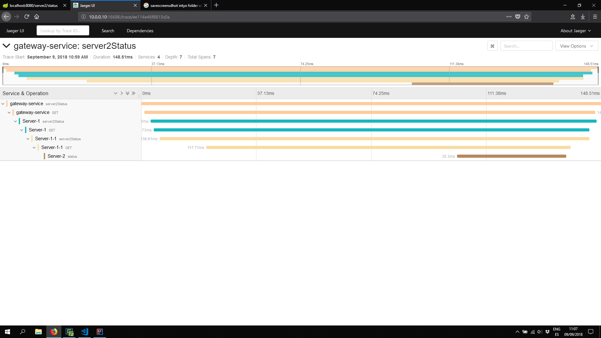
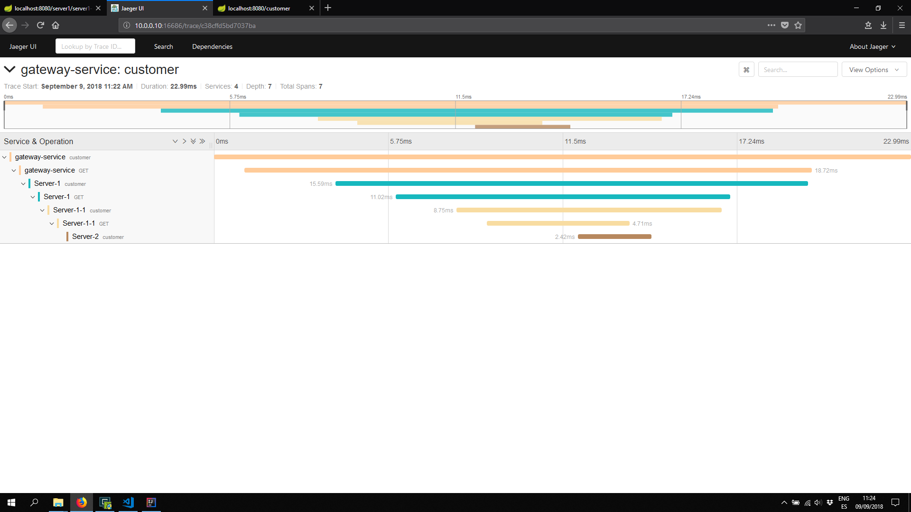
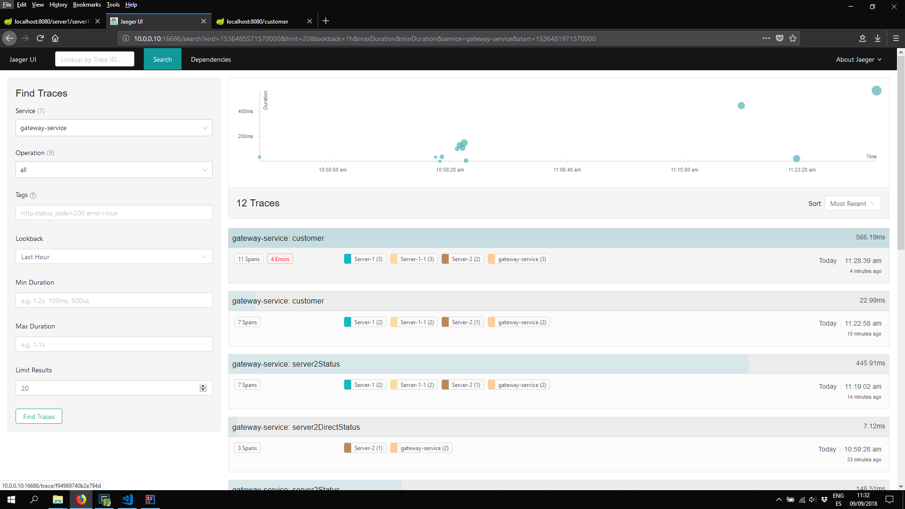
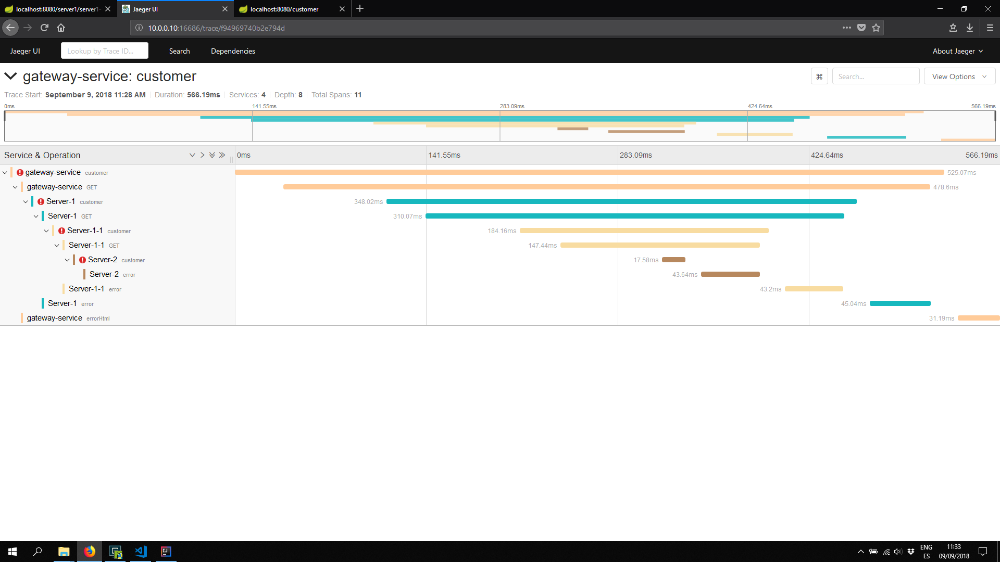
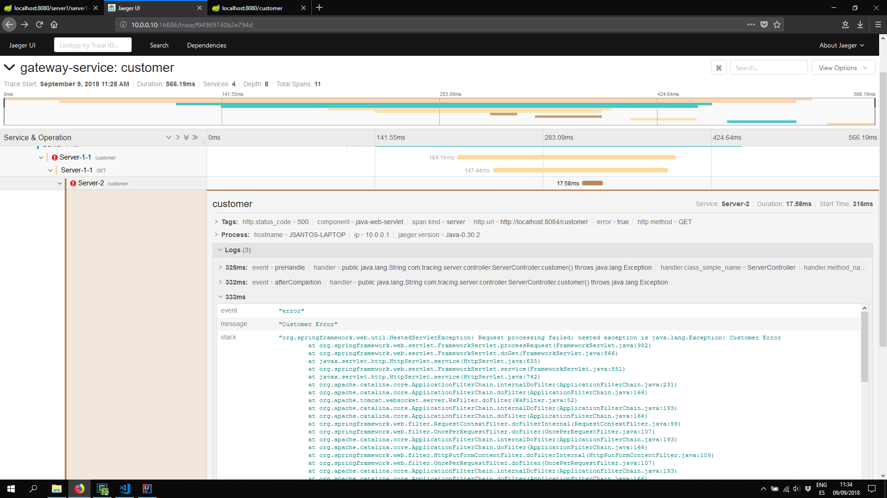

# Tracing in Microservices

## Introduction

### Tracing

Developers and engineering organizations are trading in old, monolithic systems for modern microservice architectures, and they do so for numerous compelling reasons: system components scale independently, dev teams stay small and agile, deployments are continuous and decoupled, and so on.

That said, once a production system contends with real concurrency or splits into many services, crucial (and formerly easy) tasks become difficult: *user-facing latency optimization*, *root-cause analysis of backend errors*, *communication about distinct pieces of a now-distributed system*, etc.

Contemporary **distributed tracing systems** (e.g., **Zipkin**, **Jaeger**, Dapper, HTrace, X-Trace, among others) aim to address these issues, but they do so via application-level instrumentation using incompatible APIs. Developers are uneasy about tightly coupling their polyglot systems to any particular distributed tracing implementation, yet the application-level instrumentation APIs for these many distinct tracing systems have remarkably similar semantics.

### Why OpenTracing

Enter **OpenTracing**: by offering **consistent**, **expressive**, **vendor-neutral APIs** for popular platforms, OpenTracing makes it easy for developers to add (or switch) tracing implementations with an O(1) configuration change. OpenTracing also offers a lingua franca for OSS instrumentation and platform-specific tracing helper libraries. Please refer to the Semantic Specification.

### What is a Trace

At the highest level, a **trace** tells the **story** of a **transaction** or workflow as it propagates through a (potentially distributed) system. In OpenTracing, a trace is a **directed acyclic graph** (DAG) of **spans**: named, timed operations representing a contiguous segment of work in that trace.

## Example

> For this example is going to be used Jaeger, however since we are working on OpenTracing it can be used any implementation that followos the standard OpenTracing API.

1. Start Jaeger using docker

        # Using Jaeger
        sudo docker run -d -p 5775:5775/udp -p 6831:6831/udp -p 6832:6832/udp -p 5778:5778 -p 16686:16686 -p 14268:14268 -p 9411:9411 jaegertracing/all-in-one:latest

        # Using Zipkin instead and use gradle dependencies.
        sudo docker run --rm -it -p 9411:9411 openzipkin/zipkin

    > Use the [Jaegger client documentation](https://github.com/jaegertracing/jaeger-client-java/tree/master/jaeger-core) and [Available protocols](https://www.jaegertracing.io/docs/1.6/getting-started/) to configure the jaeger's address and port.

1. Gradle dependencies (opentracing and jaeger)

    ```Groovy
    // https://mvnrepository.com/artifact/io.opentracing/opentracing-api
    compile (group: 'io.opentracing', name: 'opentracing-api', version: '0.31.0')
    // https://github.com/opentracing-contrib/java-spring-jaeger
    compile('io.opentracing.contrib:opentracing-spring-jaeger-web-starter:0.2.1')
    // https://mvnrepository.com/artifact/io.zipkin.reporter2/zipkin-reporter
    compile (group: 'io.zipkin.reporter2', name: 'zipkin-reporter', version: '2.7.7')
    ```

1. Basically use the following snippet to use OpenTracing API and Jaeger implementation

    > If no settings are changed, spans will be reported to the UDP port *6831* of *localhost*. The simplest way to change this behavior is to set the following properties:

    ```java
   @Bean
    public Tracer jaegerTracer() {
        return new io.jaegertracing.Configuration("gateway-service" )
                .withSampler(new SamplerConfiguration().withType(ConstSampler.TYPE).withParam(1))
                .withReporter(new ReporterConfiguration().withLogSpans(true)
                        .withSender(new SenderConfiguration().withAgentHost("10.0.0.10").withAgentPort(6831)))
                .getTracer();
    }
    ```

1. Verify java logs and jaeger with the **traceId** and **Spans**

    ```txt
    2018-09-08 19:17:14.510  INFO 7112 --- [nio-8080-exec-2] i.j.internal.reporters.LoggingReporter   : Span reported: e18a3bb477929bac:e9fe19d397077ed2:b067b08b660904f7:1 - hello
    2018-09-08 19:17:14.510  INFO 7112 --- [nio-8080-exec-1] i.j.internal.reporters.LoggingReporter   : Span reported: e18a3bb477929bac:b067b08b660904f7:e18a3bb477929bac:1 - GET
    ```

### Demo

#### Servers

- Jaeger Dashboard: http:/10.0.0.10:16686

- Gateway: localhost:8080
- Server1: localhost:8081
- Server1-1: localhost:8082
- Server1-2: localhost:8083
- Server2: localhost:8084

> A file called ``gradle.properties`` has been included  with thre content ``org.gradle.parallel=true`` to use **build** and **buildrun** in parallel.

#### Configuration

It has been created a **configuration** file to provide some tracing and name convention to discover different services.

``application.properties``

```java
server.port=8084
service.name=Server-2
```

#### Simple Request

- GET localhost:8080/status

- GET localhost:8080/status/chain

#### Tracing Workflow calls

> All calls mihgh by traced starting by the **gateway** server

- GET localhost:8080/status
- GET localhost:8080/status/chain
- GET localhost:8080/server1/status
- GET localhost:8080/server1/server1-1/status
- GET localhost:8080/server1/server1-2/status
- GET localhost:8080/server1/server1-1/server2/status
- GET localhost:8080/server2/status

Here are the result it can be obtained using Jaeger dashboard using OpenTracing from [this endpoint](http://localhost:8080/server1/server1-1/server2/status)

- Http Respose

    ```txt
    Server Status: Server Status: Server Status: Server-2 is UP
    ```

- Logging Support traces

    ```txt
    > Task :gateway:bootRun
    2018-09-09 11:19:03.251  INFO 15392 --- [io-8080-exec-10] i.j.internal.reporters.LoggingReporter   : Span reported: 12845b510189ad7d:ba6575aff6022624:12845b510189ad7d:1 - GET
    2018-09-09 11:19:03.255  INFO 15392 --- [io-8080-exec-10] c.t.g.controller.GatewayController       : End Call to Server1 endpoint
    2018-09-09 11:19:03.272  INFO 15392 --- [io-8080-exec-10] i.j.internal.reporters.LoggingReporter   : Span reported: 12845b510189ad7d:12845b510189ad7d:0:1 - server2Status

    > Task :server1-1:bootRun
    2018-09-09 11:19:03.209  INFO 9652 --- [nio-8082-exec-8] i.j.internal.reporters.LoggingReporter   : Span reported: 12845b510189ad7d:b9b03b354d7afcd6:150cdfe8ca731b5b:1 - GET
    2018-09-09 11:19:03.213  INFO 9652 --- [nio-8082-exec-8] c.t.server.controller.ServerController   : End Call to Server1 endpoint
    2018-09-09 11:19:03.227  INFO 9652 --- [nio-8082-exec-8] i.j.internal.reporters.LoggingReporter   : Span reported: 12845b510189ad7d:150cdfe8ca731b5b:ea5aaf8d8d561826:1 - server2Status

    > Task :server1:bootRun
    2018-09-09 11:19:03.228  INFO 2400 --- [nio-8081-exec-8] i.j.internal.reporters.LoggingReporter   : Span reported: 12845b510189ad7d:ea5aaf8d8d561826:df7c637d3cf1111a:1 - GET
    2018-09-09 11:19:03.233  INFO 2400 --- [nio-8081-exec-8] c.t.server.controller.ServerController   : End Call to Server1 endpoint
    2018-09-09 11:19:03.249  INFO 2400 --- [nio-8081-exec-8] i.j.internal.reporters.LoggingReporter   : Span reported: 12845b510189ad7d:df7c637d3cf1111a:ba6575aff6022624:1 - server2Status
    ```

- Jaeger Tracing OpenTracing implementation

    
    
    

#### Happy/Failure Scenario

- **Happy Path**

  - Server2 Controller

    ```java
    @RequestMapping("/customer")
    public String customer()  {
        return "Customer Info: OK";
        //throw new Exception("Customer Error");
    }
    ```

  - Http Respose (GET localhost:8080/customer)

    ```txt
    Customer Info: OK
    ```

  - Logging Support traces

    ```txt
    > Task :server1-1:bootRun
    2018-09-09 11:22:58.416  INFO 9652 --- [nio-8082-exec-4] c.t.server.controller.ServerController   : Start Call to Server2 endpoint
    2018-09-09 11:22:58.421  INFO 9652 --- [nio-8082-exec-4] i.j.internal.reporters.LoggingReporter   : Span reported: c38cffd5bd7037ba:c9ad57bd4a908c6d:84d23d79b663ebb6:1 - GET
    2018-09-09 11:22:58.422  INFO 9652 --- [nio-8082-exec-4] c.t.server.controller.ServerController   : End Call to Server2 endpoint
    2018-09-09 11:22:58.424  INFO 9652 --- [nio-8082-exec-4] i.j.internal.reporters.LoggingReporter   : Span reported: c38cffd5bd7037ba:84d23d79b663ebb6:9b91ca8028455881:1 - customer

    > Task :server2:bootRun
    2018-09-09 11:22:58.421  INFO 10724 --- [nio-8084-exec-5] i.j.internal.reporters.LoggingReporter   : Span reported: c38cffd5bd7037ba:55f83d6cf8f4a5c5:c9ad57bd4a908c6d:1 - customer

    > Task :gateway:bootRun
    2018-09-09 11:22:58.407  INFO 15392 --- [nio-8080-exec-6] c.t.g.controller.GatewayController       : Start Call to Server1 endpoint
    2018-09-09 11:22:58.427  INFO 15392 --- [nio-8080-exec-6] i.j.internal.reporters.LoggingReporter   : Span reported: c38cffd5bd7037ba:c87484e7b3863f95:c38cffd5bd7037ba:1 - GET
    2018-09-09 11:22:58.428  INFO 15392 --- [nio-8080-exec-6] c.t.g.controller.GatewayController       : End Call to Server1 endpoint
    2018-09-09 11:22:58.430  INFO 15392 --- [nio-8080-exec-6] i.j.internal.reporters.LoggingReporter   : Span reported: c38cffd5bd7037ba:c38cffd5bd7037ba:0:1 - customer
    ```

  - Jaeger Tracing OpenTracing implementation

    

- **Failure Path**

  - Server2 Controller

    ```java
    @RequestMapping("/customer")
    public String customer() throws Exception  {
        //return "Customer Info: OK";
        throw new Exception("Customer Error");
    }
    ```

  - Http Respose (GET localhost:8080/customer)

    ```txt
    Whitelabel Error Page

    This application has no explicit mapping for /error, so you are seeing this as a fallback.
    Sun Sep 09 11:28:40 CEST 2018
    There was an unexpected error (type=Internal Server Error, status=500).
    500 null
    ```

  - Logging Support traces

    ```txt
    java.lang.Exception: Customer Error
        at com.tracing.server.controller.ServerController.customer(ServerController.java:31) ~[main/:na]
        at java.base/jdk.internal.reflect.NativeMethodAccessorImpl.invoke0(Native Method) ~[na:na]
        at java.base/jdk.internal.reflect.NativeMethodAccessorImpl.invoke(NativeMethodAccessorImpl.java:62) ~[na:na]
        at java.base/jdk.internal.reflect.DelegatingMethodAccessorImpl.invoke(DelegatingMethodAccessorImpl.java:43) ~[na:na]
        at java.base/java.lang.reflect.Method.invoke(Method.java:564) ~[na:na]
        at org.springframework.web.method.support.InvocableHandlerMethod.doInvoke(InvocableHandlerMethod.java:209) ~[spring-web-5.0.8.RELEASE.jar:5.0.8.RELEASE]
        ...
        at org.apache.tomcat.util.net.SocketProcessorBase.run(SocketProcessorBase.java:49) [tomcat-embed-core-8.5.32.jar:8.5.32]
        at java.base/java.util.concurrent.ThreadPoolExecutor.runWorker(ThreadPoolExecutor.java:1135) [na:na]
        at java.base/java.util.concurrent.ThreadPoolExecutor$Worker.run(ThreadPoolExecutor.java:635) [na:na]
        at org.apache.tomcat.util.threads.TaskThread$WrappingRunnable.run(TaskThread.java:61) [tomcat-embed-core-8.5.32.jar:8.5.32]
        at java.base/java.lang.Thread.run(Thread.java:844) [na:na]

    2018-09-09 11:28:40.133  INFO 8576 --- [nio-8084-exec-9] i.j.internal.reporters.LoggingReporter   : Span reported: f94969740b2e794d:b21634af0016b30:9ccbca0fedb875a2:1 - error

    > Task :server1:bootRun
    2018-09-09 11:28:39.835  INFO 9212 --- [io-8081-exec-10] o.a.c.c.C.[Tomcat].[localhost].[/]       : Initializing Spring FrameworkServlet 'dispatcherServlet'
    2018-09-09 11:28:39.835  INFO 9212 --- [io-8081-exec-10] o.s.web.servlet.DispatcherServlet        : FrameworkServlet 'dispatcherServlet': initialization started
    2018-09-09 11:28:39.849  INFO 9212 --- [io-8081-exec-10] o.s.web.servlet.DispatcherServlet        : FrameworkServlet 'dispatcherServlet': initialization completed in 14 ms
    2018-09-09 11:28:39.871  INFO 9212 --- [io-8081-exec-10] c.t.server.controller.ServerController   : Start Call to Server1-1 endpoint
    2018-09-09 11:28:40.196  INFO 9212 --- [io-8081-exec-10] i.j.internal.reporters.LoggingReporter   : Span reported: f94969740b2e794d:5698e3608f8c17bf:7aaf28b2f931ba6a:1 - GET
    2018-09-09 11:28:40.205  INFO 9212 --- [io-8081-exec-10] i.j.internal.reporters.LoggingReporter   : Span reported: f94969740b2e794d:7aaf28b2f931ba6a:fcecd09b36aece5:1 - customer
    2018-09-09 11:28:40.209 ERROR 9212 --- [io-8081-exec-10] o.a.c.c.C.[.[.[/].[dispatcherServlet]    : Servlet.service() for servlet [dispatcherServlet] in context with path [] threw exception [Request processing failed; nested exception is org.springframework.web.client.HttpServerErrorException: 500 null] with root cause

    org.springframework.web.client.HttpServerErrorException: 500 null
        at org.springframework.web.client.DefaultResponseErrorHandler.handleError(DefaultResponseErrorHandler.java:97) ~[spring-web-5.0.8.RELEASE.jar:5.0.8.RELEASE]
        at org.springframework.web.client.DefaultResponseErrorHandler.handleError(DefaultResponseErrorHandler.java:79) ~[spring-web-5.0.8.RELEASE.jar:5.0.8.RELEASE]
        at org.springframework.web.client.ResponseErrorHandler.handleError(ResponseErrorHandler.java:63) ~[spring-web-5.0.8.RELEASE.jar:5.0.8.RELEASE]
        at org.springframework.web.client.RestTemplate.handleResponse(RestTemplate.java:766) ~[spring-web-5.0.8.RELEASE.jar:5.0.8.RELEASE]
        at org.springframework.web.client.RestTemplate.doExecute(RestTemplate.java:724) ~[spring-web-5.0.8.RELEASE.jar:5.0.8.RELEASE]
        at org.springframework.web.client.RestTemplate.execute(RestTemplate.java:680) ~[spring-web-5.0.8.RELEASE.jar:5.0.8.RELEASE]
        at org.springframework.web.client.RestTemplate.getForEntity(RestTemplate.java:359) ~[spring-web-5.0.8.RELEASE.jar:5.0.8.RELEASE]
        ...
        at org.apache.tomcat.util.net.SocketProcessorBase.run(SocketProcessorBase.java:49) [tomcat-embed-core-8.5.32.jar:8.5.32]
        at java.base/java.util.concurrent.ThreadPoolExecutor.runWorker(ThreadPoolExecutor.java:1135) [na:na]
        at java.base/java.util.concurrent.ThreadPoolExecutor$Worker.run(ThreadPoolExecutor.java:635) [na:na]
        at org.apache.tomcat.util.threads.TaskThread$WrappingRunnable.run(TaskThread.java:61) [tomcat-embed-core-8.5.32.jar:8.5.32]
        at java.base/java.lang.Thread.run(Thread.java:844) [na:na]

    2018-09-09 11:28:40.260  INFO 9212 --- [io-8081-exec-10] i.j.internal.reporters.LoggingReporter   : Span reported: f94969740b2e794d:c95c3d694339c668:7aaf28b2f931ba6a:1 - error
    ```

  - Jaeger Tracing OpenTracing implementation

    
    
    

## References

[Quiuck Start](http://opentracing.io/documentation/pages/quick-start)
[Open Tracing Web](http://opentracing.io/)
[OpenTracing API](https://github.com/opentracing)
[OpenTracing API for JAVA](https://github.com/opentracing/opentracing-java)
[Jaeger spring Client For Java](https://github.com/opentracing-contrib/java-spring-jaeger)
